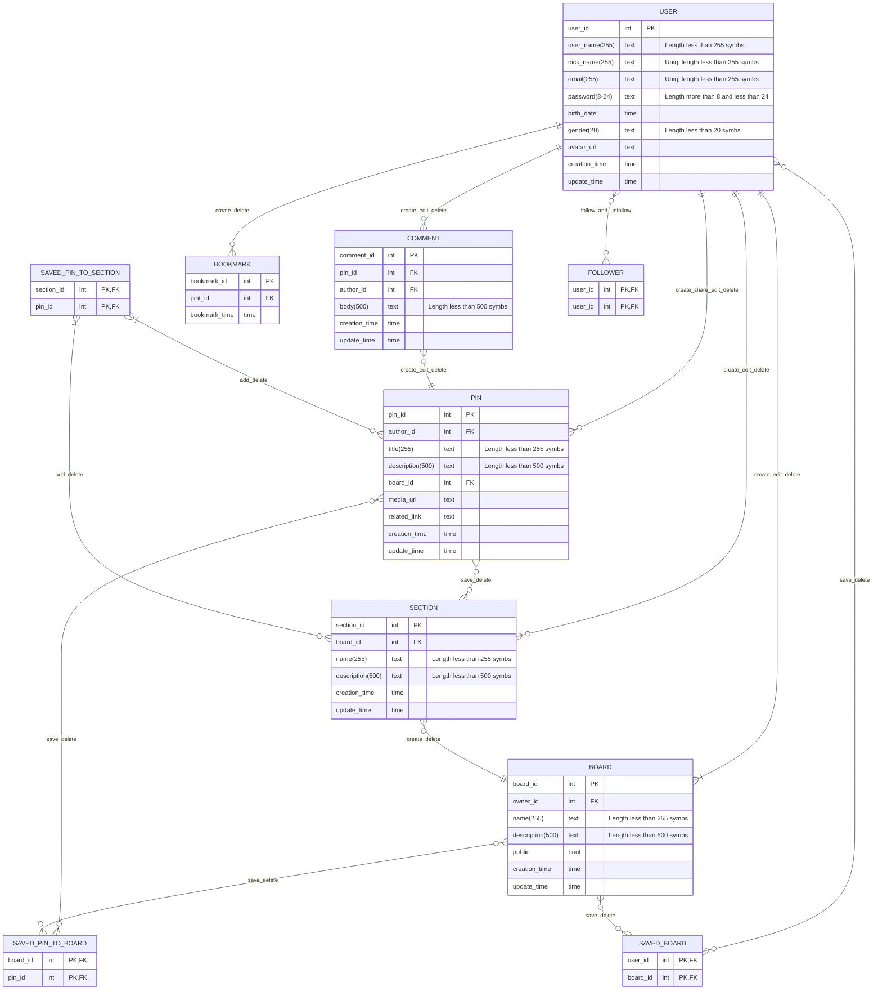

```mermaid
erDiagram

    USER ||--o{COMMENT: create_edit_delete
    USER ||--|{BOARD: create_edit_delete
    USER ||--o{SECTION: create_edit_delete
    USER ||--o{PIN: create_share_edit_delete
    USER ||--o{BOOKMARK: create_delete
    COMMENT o{--|| PIN: create_edit_delete
    PIN o{--o{ SECTION: save_delete
    PIN  o{--o{ SAVED_PIN_TO_BOARD : save_delete
    BOARD o{--o{ SAVED_PIN_TO_BOARD: save_delete
    SECTION o{--|| BOARD: create_delete
    SAVED_PIN_TO_SECTION |{--o{ SECTION: add_delete
    SAVED_PIN_TO_SECTION |{--o{PIN: add_delete
    USER o{--o{FOLLOWER: follow_and_unfollow
    USER o{--o{SAVED_BOARD: save_delete
    BOARD o{--o{SAVED_BOARD: save_delete

    USER {
        user_id int PK
        user_name(255) text "Length less than 255 symbs"
        nick_name(255) text "Uniq, length less than 255 symbs"
        email(255) text "Uniq, length less than 255 symbs"
        password(8-24) text "Length more than 8 and less than 24"
        birth_date time
        gender(20) text "Length less than 20 symbs"
        avatar_url text
        creation_time time
        update_time time 
    }

    BOOKMARK {
        bookmark_id int PK
        pint_id int FK
        bookmark_time time
    }

    COMMENT {
        comment_id int PK
        pin_id int FK
        author_id int FK
        body(500) text "Length less than 500 symbs"
        creation_time time
        update_time time
    }
    
    SECTION {
        section_id int PK
        board_id int FK
        name(255) text "Length less than 255 symbs"
        description(500) text "Length less than 500 symbs"
        creation_time time
        update_time time
    }

    PIN {
        pin_id int PK
        author_id int FK
        title(255) text "Length less than 255 symbs"
        description(500) text "Length less than 500 symbs"
        board_id int FK
        media_url text
        related_link text
        creation_time time
        update_time time
    }

    BOARD {
        board_id int PK
        owner_id int FK
        name(255) text "Length less than 255 symbs"
        description(500) text "Length less than 500 symbs"
        public bool
        creation_time time
        update_time time
    }

    SAVED_PIN_TO_BOARD {
        board_id int PK,FK
        pin_id int PK,FK
    }

    SAVED_PIN_TO_SECTION {
        section_id int PK,FK
        pin_id int PK,FK
    }

    FOLLOWER {
        user_id int PK,FK
        user_id int PK,FK
    }

    SAVED_BOARD {
        user_id int PK, FK
        board_id int PK, FK
    }
```